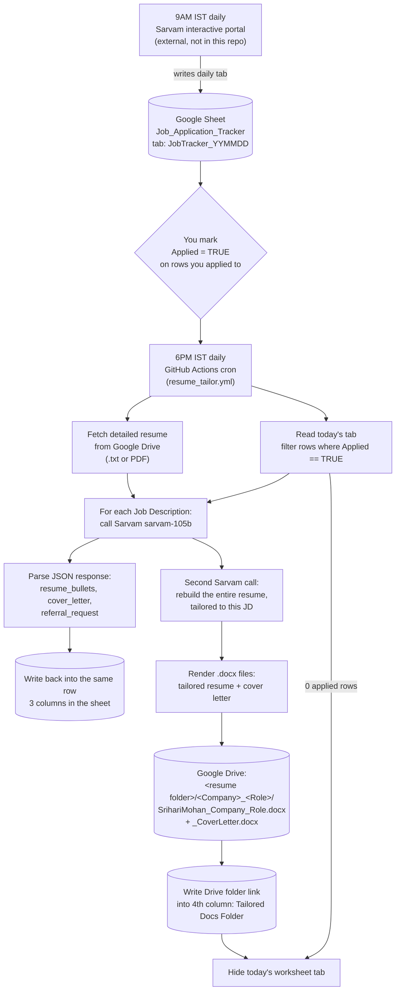

# ResumeBuilder — Daily Resume Tailoring Pipeline

Automates the second half of a daily job-search workflow:

1. **9AM IST (external, not in this repo)** — a Sarvam "interactive portal" job runs job-search + market-research prompts and writes results into a Google Sheet (`Job_Application_Tracker`), one tab per day named `JobTracker_YYMMDD`.
2. **You** mark the `Applied` column `TRUE` for any row you've applied to.
3. **6PM IST (this repo, via GitHub Actions)** — reads today's tab, finds every row with `Applied == TRUE`, and for each one uses Sarvam's `sarvam-105b` model to generate tailored resume bullet points, a cover letter, and a referral request message against that specific job description — writes the results back into the same row, and also rebuilds the **entire tailored resume** plus the cover letter as `.docx` files, saved into a per-application folder in Google Drive. Once the run finishes, it hides today's tab (so the sheet's tab bar doesn't fill up with old dates) — this happens every run, even on days with 0 applied rows.

## How it works



## Repo structure

```
src/
  automation/           # the production pipeline
    config.py           # env vars, constants, today's tab-name logic
    sheet_client.py      # Google Sheets read/write (gspread)
    drive_client.py       # Google Drive read (resume) + write (tailored docs) helpers
    docgen.py              # builds tailored resume / cover letter .docx files
    sarvam_client.py      # calls Sarvam AI (sarvam-105b) with retry/backoff
    response_parser.py    # parses Sarvam's JSON response robustly
    prompt.py              # renders the resume_enhance_prompt.txt template
    full_resume_prompt.py   # renders the full_resume_rebuild_prompt.txt template
    run_pipeline.py         # entrypoint — orchestrates the whole run
  prompts/
    resume_enhance_prompt.txt         # LLM prompt for the 3 sheet columns
    full_resume_rebuild_prompt.txt    # LLM prompt for the full tailored resume doc
  scratch/                # exploratory trial scripts (reference only, not used in production)
.github/workflows/
  resume_tailor.yml       # daily cron (6PM IST) + manual trigger
requirements.txt
Dockerfile, docker-compose.yml
```

## Prerequisites

- A Google Cloud **service account** with:
  - Access scope: Google Drive **read-only** (fetch the detailed resume) and Google Sheets (read/write)
  - Shared as an editor on the `Job_Application_Tracker` Google Sheet
  - Shared as a viewer on the Google Drive file containing your detailed resume (plain `.txt` or a `.pdf` export both work)
- **OAuth credentials for your own Google account**, used only to write the tailored `.docx` files into Drive. This is separate from the service account because **service accounts have no Drive storage quota of their own and cannot create files/folders in a personal (non-Workspace) Google Drive** — writes must happen under your account's own quota instead. One-time setup:
  1. In the same Google Cloud project, go to **APIs & Services → OAuth consent screen**, set User type to External, add yourself as a test user, then **Publish App** (moving it out of "Testing" avoids a 7-day refresh-token expiry — an unverified-app warning during login is expected and fine for personal use).
  2. Go to **APIs & Services → Credentials → Create Credentials → OAuth client ID**, application type **Desktop app**, and download its JSON.
  3. Run a one-time local script using `google-auth-oauthlib`'s `InstalledAppFlow` (scope `https://www.googleapis.com/auth/drive`) to log in as yourself and mint a refresh token — this refresh token doesn't expire.
- The Google Drive folder where tailored docs should be written (this can be the same folder your resume files live in — the pipeline creates a subfolder per application inside it) needs to be one **you** (the OAuth account) already own or can write to — no separate sharing step needed since it's your own account.
- A **Sarvam AI** API subscription key (`sarvam-105b` access)
- Python 3.12+ (if running locally without Docker) or Docker

## Setup

1. Copy `.env.example` to `.env` and fill in the values:
   ```
   SARVAM_API_KEY=...
   DETAILED_RESUME_TXT_ID=...   # Google Drive file ID of your detailed_resume.txt
   DRIVE_OUTPUT_FOLDER_ID=...   # Google Drive folder ID where tailored docs get written
   GOOGLE_OAUTH_CLIENT_ID=...
   GOOGLE_OAUTH_CLIENT_SECRET=...
   GOOGLE_OAUTH_REFRESH_TOKEN=...
   SPREADSHEET_NAME=Job_Application_Tracker   # optional, this is the default
   CANDIDATE_FILE_PREFIX=SrihariMohan   # optional, used as the filename prefix for generated docs
   ```
2. Download your Google service account's JSON key and save it as `service_account.json` in the repo root (already gitignored — never commit this file).

## Running locally

**Without Docker:**
```
python -m venv venv
venv/Scripts/activate        # Windows; use `source venv/bin/activate` on macOS/Linux
pip install -r requirements.txt
python src/automation/run_pipeline.py
```

**With Docker:**
```
docker compose run --rm resume-tailor
```
This builds the image, mounts your `service_account.json` read-only, loads `.env`, and runs the pipeline once. It does not schedule anything by itself — scheduling is handled by GitHub Actions (see below) or you can trigger it manually whenever you want.

The pipeline is safe to run at any time: it always looks at the tab matching today's date (`JobTracker_YYMMDD` in Asia/Kolkata time) and only touches rows where `Applied == TRUE`. If today's tab doesn't exist yet (the 9AM job hasn't run), it aborts cleanly with a clear error instead of guessing. At the end of every run it hides today's tab (`ws.hide()`) — re-running the same day still works fine (a hidden sheet is still readable/writable, `gc.open(...).worksheet(...)` finds it by name regardless), it just won't clutter the visible tab bar. Unhide it manually in Google Sheets (right-click the tab list → "Show hidden sheets") if you need to look at a past day's raw data.

## GitHub Actions (automated daily run)

The workflow at `.github/workflows/resume_tailor.yml` runs daily at 12:30 UTC (18:00 IST) and can also be triggered manually.

Before it can run, create these repository secrets (**Settings → Secrets and variables → Actions → New repository secret**):

| Secret name | Value |
|---|---|
| `GOOGLE_SERVICE_ACCOUNT_JSON` | Full contents of your `service_account.json` |
| `SARVAM_API_KEY` | Your Sarvam API key |
| `DETAILED_RESUME_TXT_ID` | Google Drive file ID of your detailed resume `.txt` |
| `DRIVE_OUTPUT_FOLDER_ID` | Google Drive folder ID where tailored resume/cover-letter docs get written |
| `GOOGLE_OAUTH_CLIENT_ID` | OAuth client ID from the Desktop app credential (see Prerequisites) |
| `GOOGLE_OAUTH_CLIENT_SECRET` | OAuth client secret from the same credential |
| `GOOGLE_OAUTH_REFRESH_TOKEN` | The refresh token minted via the one-time local consent flow |

These are encrypted secrets — safe to use even on a public repo, since this workflow only uses `schedule`/`workflow_dispatch` triggers (never `pull_request`), so forks never get access to them.

To test before trusting the schedule: **Actions tab → "Daily Resume Tailor" → "Run workflow"**.

## Expected Google Sheet schema

Each `JobTracker_YYMMDD` tab is expected to have its real header row on **row 2** (row 1 may be a section title/banner), with at least these columns:

`Company | ... | Job Description (full JD text) | Applied`

The pipeline appends six more columns the first time it runs against a tab: `Resume Bullet Points | Cover Letter | Referral Request | Tailored Docs Folder | Keywords Matched | Why These Changes`.
- `Tailored Docs Folder` is a link to the Google Drive folder holding that application's tailored resume + cover letter `.docx` files.
- `Keywords Matched` / `Why These Changes` surface Sarvam's own explanation of which JD keywords it matched and why it made the specific edits it did — useful for sanity-checking the output before you use it.

## Troubleshooting

- **`Worksheet '...' not found`** — today's tab hasn't been created yet by the 9AM job. Wait for it or check the upstream job.
- **A row gets `ERROR: ...` in its Resume Bullet Points cell** — that row's Sarvam call or JSON parsing failed after retries; other rows are unaffected. Check the Actions run log for the full error.
- **Sarvam returns empty content / `finish_reason=length`** — `sarvam-105b` is a reasoning model that can spend its whole token budget on internal reasoning before answering. `sarvam_client.py` already sets `reasoning_effort="low"` and `max_tokens=4096` (the starter-tier ceiling) to avoid this; if you're on a higher tier you can raise `SARVAM_MAX_TOKENS` in `config.py`.
- **`UnicodeDecodeError` fetching the resume** — `drive_client.py` auto-detects PDF vs. plain text (by checking for the `%PDF-` header) and extracts text accordingly via `pypdf`. If this still fails, the Drive file may be some other binary format (e.g. `.docx`) that isn't supported yet.
- **A row gets `ERROR: ...` in its Tailored Docs Folder cell** — the sheet's 3 main columns (bullets/cover letter/referral) still succeeded; only the Drive doc-generation step failed for that row. Check the Actions log for the underlying error.
- **`storageQuotaExceeded` when writing docs** — this means the write path fell back to the service account instead of the OAuth user credentials. Service accounts have no Drive storage quota and can't own new files/folders in a personal Drive; `GOOGLE_OAUTH_CLIENT_ID`/`_SECRET`/`_REFRESH_TOKEN` must be set correctly for `drive_client.get_drive_write_service()` to use your own account instead.
- **OAuth login stops working after months of inactivity** — Google can revoke long-unused refresh tokens (typically after 6+ months, or if you change your Google account password). Re-run the one-time local consent flow to mint a new one and update the `GOOGLE_OAUTH_REFRESH_TOKEN` secret.
